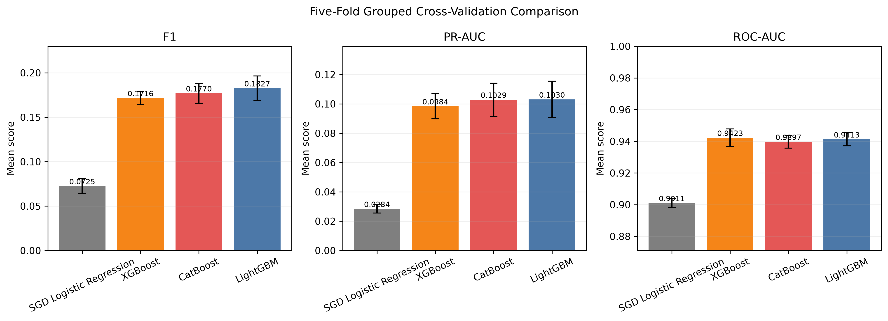

# V4FinBench — Financial Distress Benchmarking

**Compare models under extreme class imbalance, then examine how their results hold up over time.**

  

A research benchmark for one-year-ahead corporate financial distress using the V4 group corporate bankruptcy dataset. The project compares SGD Logistic Regression, XGBoost, CatBoost, and LightGBM with company-grouped folds, a separate temporal evaluation, threshold selection on validation data, and feature-timing audits.

## Dataset and protocol

- 996,500 company-year records, 131 features, and 3,054 positive records in the saved experiment.
- Five folds keep each company-country group together and distribute groups within countries.
- Temporal study: train through 2017, validate on 2018, test on 2019.
- The source file is `company_years_h2.parquet`; the supplied task mapping identifies this as a one-year horizon.
- Thresholds are selected on validation data and applied unchanged to test data.

## Saved results

Mean results across five grouped folds, taken from the included report package:

| Model | F1 | ROC-AUC | Average precision |
| --- | ---: | ---: | ---: |
| SGD Logistic Regression | 0.0725 | 0.9011 | 0.0284 |
| XGBoost | 0.1716 | 0.9423 | 0.0984 |
| CatBoost | 0.1770 | 0.9397 | 0.1029 |
| LightGBM | **0.1827** | 0.9413 | **0.1030** |

LightGBM has the strongest mean F1 and average precision in these runs. Its 2019 temporal test reports F1 **0.1499**, ROC-AUC **0.9281**, and average precision **0.0687**. These results are saved evidence; the full experiments were not rerun for this GitHub publication.



## Reproduce the core workflow

```bash
python -m venv .venv
# Activate the environment for your operating system.
python -m pip install -r requirements.txt
python download_data.py
python create_folds.py
python prepare_features.py
python cross_validate_logistic.py
python cross_validate_xgboost.py
python cross_validate_catboost.py
python cross_validate_lightgbm.py
python temporal_validate_lightgbm.py
```

Run from the repository root. Download access and dataset terms are governed by the [Kaggle dataset source](https://www.kaggle.com/datasets/sebastiantomczak10/v4-group-corporate-bankruptcy). The dataset and virtual environment are excluded. The dependency list contains direct imports; the original environment snapshot is preserved inside the report package. Installation and full model execution have not been validated here.

## Audit and interpretation

`audit_feature_timing.py`, `final_leakage_audit.py`, and `ablate_timing_lightgbm.py` examine the historical availability of `operational_status`. It is almost constant within company groups, so its point-in-time availability needs clarification. The saved no-status sensitivity result is retained. Predictive power alone does not prove leakage.

Class imbalance makes accuracy insufficient; review positive-class F1, recall, precision, and average precision together. Country-level results show uneven transfer of a global threshold. The project is a research benchmark with unresolved timing limitations, not a validated lending or deployment system.

## Included artifacts

The `results/h1_ieee_report_package_*/` folder includes aggregate comparison tables, temporal results, SHAP summaries, figures, and supporting metadata. Raw financial records, row-level predictions, trained models, and the bundled virtual environment are excluded. Some secondary analysis scripts reference historical run folders; recreate those runs or adjust their path constants before using them.
